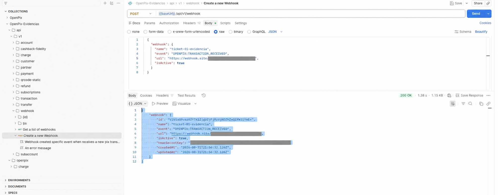
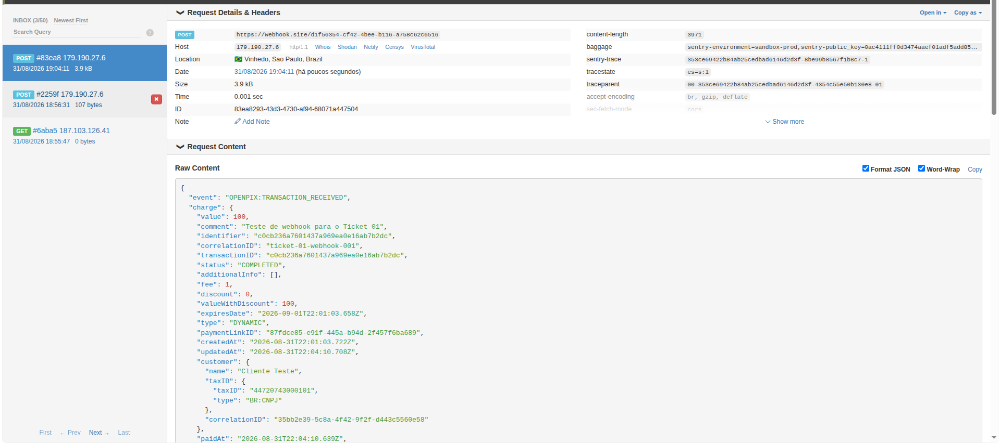

# Woovi / OpenPix — Customer Support Tech Challenge

Este repositório organiza as respostas dos 11 tickets do desafio técnico de Customer Support da Woovi / OpenPix. O objetivo é produzir análises investigáveis e mensagens seguras para clientes, demonstrando clareza técnica, empatia e cuidado com impacto financeiro, segurança, privacidade e compliance.

## Estrutura

- `respostas/`: uma resposta para cada um dos 11 tickets, com nome descritivo.
- `respostas/TEMPLATE.md`: modelo obrigatório para cada resposta.
- `evidencias/`: evidências complementares de testes controlados, organizadas por ticket. Atualmente contém o fluxo Sandbox do Ticket 01.
- `referencias/fontes.md`: fontes iniciais e regras para pesquisa e citação.
- `.cursor/`: instruções locais já existentes; deve ser preservado.

## Requisitos para cada ticket

Para cada um dos 11 tickets do enunciado oficial, crie um arquivo Markdown em `respostas/` com um nome descritivo e siga integralmente o modelo em `respostas/TEMPLATE.md`. Antes de finalizar cada arquivo, confira todos os requisitos e perguntas específicos daquele ticket no enunciado; as sete seções abaixo são obrigatórias e não substituem esses requisitos:

1. Entendimento do problema;
2. Informações necessárias;
3. Plano de investigação;
4. Hipóteses priorizadas;
5. Resposta ao cliente;
6. Follow-ups internos;
7. Fontes e suposições.

Não crie respostas para tickets que não estejam no enunciado nem deixe requisitos específicos sem atendimento. O `TEMPLATE.md` é um guia de estrutura: adapte seus campos ao caso e remova as instruções e placeholders antes da entrega.

Trate o relato como evidência inicial, não como diagnóstico. Diferencie fatos, hipóteses, inferências e lacunas; proponha testes que confirmem ou descartem cada hipótese; e não invente status, logs, endpoints, campos, políticas, prazos ou ações internas. A resposta ao cliente deve ser pronta para envio, objetiva e empática, sem expor informações internas, dados pessoais ou segredos.

## Como trabalhar

1. Leia o ticket e registre produto, impacto, atores, identificadores, cronologia, comportamento esperado e observado.
2. Use o template para estruturar a investigação; solicite apenas dados necessários e indique o canal seguro quando houver informação sensível.
3. Consulte fontes primárias relevantes e registre links, data de acesso quando necessário e suposições a validar.
4. Priorize verificações seguras, rápidas e discriminatórias antes de envolver outras equipes ou terceiros.
5. Revise a resposta: ela deve ser executável por outra pessoa, não prometer prazo sem evidência e deixar claro o próximo passo.

## Evidências complementares

Evidências práticas são opcionais e não substituem a investigação do caso relatado. Quando um teste controlado for útil, registre seu objetivo, ambiente, resultado e limitação na seção **Fontes e suposições** da resposta correspondente.

O Ticket 01 inclui um fluxo validado no Sandbox da Woovi: configuração do webhook `OPENPIX:TRANSACTION_RECEIVED`, criação de uma cobrança de R$ 1,00, simulação de pagamento e recebimento do `POST` pelo endpoint de teste. As capturas estão em [`evidencias/ticket-01/`](evidencias/ticket-01/). Esse resultado demonstra o fluxo técnico em ambiente controlado, mas não comprova a causa de uma falha em operações reais.

### Ticket 01 — webhook configurado no Sandbox

O primeiro passo registra a criação bem-sucedida de um webhook ativo para o evento `OPENPIX:TRANSACTION_RECEIVED` pela collection OpenPix no Postman. Credenciais e URL temporária de recebimento foram ocultadas.

### Ticket 01 — confirmação do webhook

Após criar a cobrança e simular seu pagamento no Sandbox, o endpoint de teste recebeu o `POST` com o evento `OPENPIX:TRANSACTION_RECEIVED`, encerrando o fluxo de validação.

## Segurança

Não versione credenciais, tokens, chaves, payloads com dados pessoais, exports de produção ou qualquer segredo. Use apenas exemplos sanitizados e remova identificadores sensíveis antes de registrar evidências.
